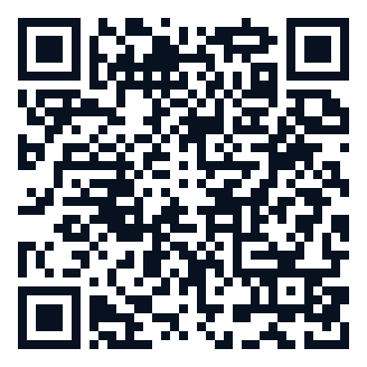

## Your phone is guessing right now {.center .hook-slide}

You drive into a tunnel. GPS goes dark.

<p class="hook-big">The blue dot <strong>keeps moving.</strong></p>

How does your phone know where you are?

::: notes
**~1 min.** Ask the room before advancing: "Has anyone seen this happen?" Most will have. Let one or two students guess how it works. Don't answer yet. "By the end of today you'll know exactly how. You'll even run the same loop yourself."
:::

## The same trick is everywhere {.compact-slide}

```{=html}
<div class="use-grid">
<div><h3>Phone GPS</h3><p>Keeps the dot smooth between satellite fixes and through tunnels.</p></div>
<div><h3>Drones</h3><p>Stay level in the wind using shaky motion sensors.</p></div>
<div><h3>VR headsets</h3><p>Track your head hundreds of times a second so you don't get sick.</p></div>
<div><h3>FIRST Robotics</h3><p>Robots read AprilTags on the field to work out where they are.</p></div>
<div><h3>Self-driving cars</h3><p>Blend camera, radar, and wheel data into one picture of the road.</p></div>
<div><h3>Apollo 11</h3><p>Helped navigate the 1969 Moon landing on a tiny computer.</p></div>
</div>
```

::: {.takeaway-line}
They all use the same idea: a **Kalman filter**. Today you'll learn how one works.
:::

::: notes
**~1 min.** Don't read every tile. Point to the two or three that fit the room. If the class has robotics students, spend your time on FIRST Robotics: "The robot demo at the end of today is the same kind of filter teams use." Apollo is a good closer: "If it was good enough to land on the Moon in 1969, it's worth 40 minutes."
:::

## Your turn: where is the cart? {.center .cart-hook}

A cart rolls along a track. **Its motion** says it should be at **4 m**. **A sensor** says **7 m**.

<div class="cart-choice" role="img" aria-label="Motion guess at 4 meters and sensor reading at 7 meters on a track; the answer is still open."><span>4 m<br><small>motion</small></span><span class="cart-choice-question">Your guess?</span><span>7 m<br><small>sensor</small></span></div>

```{=html}
<div class="vote-grid">
<span><b>1 finger</b> 4 m</span><span><b>2 fingers</b> 7 m</span><span><b>3 fingers</b> 5.5 m</span><span><b>4 fingers</b> something else</span>
</div>
```

**Vote, then defend your pick.**

::: notes
**~3 min. This is the question the whole talk answers.** Count the votes out loud and write the split on the board so you can come back to it.

Ask a student from each camp to defend their choice:

- *7 m*: "The sensor is newer information."
- *4 m*: "Sensors can glitch."
- *5.5 m*: "I don't know who to trust, so I split it."

Point out that every argument is really about **who to trust more**. Don't settle it. "Hold on to your answer. We'll find out who was closest."
:::

## Try it: guess the hidden bag {#interactive-bayes .compact-slide}

**Bag A:** 90% blue balls. **Bag B:** half blue, half yellow. We start at 50/50. **Before each draw, predict:** which bag would a blue ball point to?

<div class="interactive-bayes" data-bayes-demo>
<div class="demo-toolbar">
<button type="button" class="demo-button reset-button" data-action="reset">Choose a new hidden bag</button>
<button type="button" class="demo-button draw-button" data-action="draw">Draw a ball</button>
<button type="button" class="demo-button reveal-button" data-action="reveal">Reveal the bag</button>
<button type="button" class="demo-button" data-action="show-math" aria-expanded="false">Show the arithmetic</button>
<span class="hidden-box-status" data-role="box-status">A hidden bag is ready.</span>
</div>

<div class="demo-summary">
<div class="draw-result" data-role="draw-result">
<span class="result-ball neutral"></span>
<span><strong>No draws yet</strong><small>Draw a ball to get a clue.</small></span>
</div>
<div class="draw-history-wrap">
<strong>Balls drawn so far</strong>
<div class="draw-history" data-role="history"><span class="empty-history">None yet</span></div>
</div>
</div>

<div class="live-math" data-role="math" aria-live="polite" hidden>
<div class="math-stage">
<span class="stage-label">1. Starting guess</span>
<strong>Bag A <span data-role="prior-a">50.0%</span></strong>
<small>Bag B <span data-role="prior-b">50.0%</span></small>
</div>
<div class="math-operator">×</div>
<div class="math-stage">
<span class="stage-label">2. Chance of this color</span>
<strong>Bag A gives <span data-role="color-one">it</span>: <span data-role="like-a">—</span></strong>
<small>Bag B gives <span data-role="color-two">it</span>: <span data-role="like-b">—</span></small>
</div>
<div class="math-operator">→</div>
<div class="math-stage">
<span class="stage-label">3. Scores</span>
<strong>Bag A: <span data-role="weight-a">—</span></strong>
<small>Bag B: <span data-role="weight-b">—</span></small>
</div>
<div class="math-operator">→</div>
<div class="math-stage result-stage">
<span class="stage-label">4. Rescale to 100%</span>
<strong>Bag A <span data-role="posterior-a">50.0%</span></strong>
<small>Becomes the next starting guess</small>
</div>
</div>

<div class="belief-bar interactive-belief" role="img" data-role="belief-bar" aria-label="Current guess: Bag A 50 percent, Bag B 50 percent.">
<span class="belief-a" data-role="bar-a" style="width: 50%;">Bag A 50.0%</span><span class="belief-b" data-role="bar-b" style="width: 50%;">Bag B 50.0%</span>
</div>

<div class="demo-explanation" data-role="explanation">Each new ball changes our guess. Draw again to see how the guess responds.</div>
</div>

::: notes
**~5 min.** Before the first draw, ask: "If I pull a **blue** ball, which bag should we lean toward?" (A, since it's 90% blue.) "And **yellow**?" (B, since A almost never gives yellow.)

Draw 4–6 times and let students call out their prediction each time. After a yellow ball, say clearly: "Yellow points hard at Bag B." Wait until after several draws to reveal, so one lucky ball doesn't look like proof.

Then open **Show the arithmetic** once, slowly: *starting guess × chance of this color = score, then rescale the scores to add to 100%.* **That multiply-then-rescale step is the engine of the whole talk.** Tell the class it comes back.
:::

## Is she clutch? {.center}

A basketball player took **100 free throws** this season and made **77**.

$$P(\text{made}) = \frac{\text{shots made}}{\text{all shots}} = \frac{77}{100} = 77\%$$

The bottom of the fraction answers: **out of which shots?**

::: notes
**~1 min.** "P" just means "chance of." Ask: "Would you want her shooting with the game on the line?" Most will say yes, since 77% is good. "Let's check."
:::

## Add a second fact {.dense-diagram auto-animate=true data-autoslide="0"}

**20** shots came in the **final minute** of close games. She made **10** of those.

::: {.legacy-diagram}

<div data-id="circle1" style="position: absolute; left: 160.000px; top: 70.000px; width: 800.000px; height: 800.000px; background: rgba(98, 195, 255, 0.28); border: 3px solid #62c3ff; border-radius: 50%;"></div>

<div data-id="label1" style="position: absolute; left: 300px; top: 180px; color: white; font-size: 40px; ">77 made</div>

<div data-id="circle2" style="position: absolute; left: 738.283px; top: 266.141px; width: 407.718px; height: 407.718px; background: rgba(255, 201, 87, 0.28); border: 3px solid #ffc957; border-radius: 50%;"></div>

<div data-id="label2" style="position: absolute;left: 900px; top: 200px; color: white; font-size: 30px; ">20 final-minute shots</div>

:::{.fragment}
<div style="position: absolute; left: 765px; top: 470px; width: 210px; color: #ffe2a3; font-size: 27px; font-weight: bold; text-align: center; text-shadow: 2px 2px 4px black;">10 made <b>and</b> final-minute</div>
:::
:::

::: notes
**~2 min.** Circle area matches the count: the blue circle is 77 shots, the yellow is 20. Click to show the overlap. "The overlap holds shots that are **both** final-minute **and** made. That's what 'and' means in probability: the shared part."
:::

## Quick check: is she clutch?

We want her chance of making a shot **in the final minute**.

Count out of **100 shots**, **77 makes**, or **20 final-minute shots**?

::: {.fragment .fade-up}
**20 final-minute shots.** She made 10 of them: **10 ÷ 20 = 50%**.

Overall she makes 77%. Under pressure, only 50%.
:::

::: {.takeaway-line}
**The clue picks the group we count inside.**
:::

::: notes
**~2 min. Checkpoint.** Have students show 1, 2, or 3 fingers for the three choices *before* you reveal. If many choose 100, slow down: "We already *know* it was a final-minute shot. The other 80 shots don't matter for this question."

The 77% vs 50% surprise is the payoff. A new clue changed the answer a lot.
:::

## Zoom in on the 20 final-minute shots {.dense-diagram auto-animate=true data-autoslide="0"}

Only the yellow circle matters now. Inside it: **10 made out of 20**.

Shorthand: $P(\text{made} \mid \text{final minute}) = \frac{10}{20} = 50\%$. Read the bar **|** as **"given"**: look only inside this group.

::: {.legacy-diagram}

<div data-id="circle2" style="position: absolute; left: 716.111px; top: 230.755px; width: 448.490px; height: 448.490px; background: rgba(255, 201, 87, 0.24); border: 4px solid #ffc957; border-radius: 50%;"></div>

<div data-id="circle1" style="position: absolute; left: 80.000px; top: 15.000px; width: 880.000px; height: 880.000px; background: rgba(98, 195, 255, 0.16); border: 4px solid rgba(98, 195, 255, 0.45); border-radius: 50%;"></div>

<div data-id="label1" style="position: absolute; left: 762px; top: 500px; width: 195px; color: white; font-size: 28px; text-align: center;">10 made</div>

<div data-id="label2" style="position: absolute; left: 1080px; top: 70px; color: #ffe2a3; font-size: 34px;">20 final-minute shots</div>

:::

::: notes
**~1 min.** The circles grow, but the counts don't change. "Everything after the bar is the group we're standing inside." Students don't need to memorize the notation. They need "given = count inside this group."
:::

## The short version so far {.center .rejoin-slide}

**"And"** means the overlap: **10 shots**.

**"Given"** means count inside that group: **out of 20**.

**The bag:** each clue → **multiply** by how likely that clue was → **rescale** to 100%.

That last line is the engine. Watch for it with the cart.

::: notes
**~1 min. Rejoin point.** Anyone who got lost in the circles can pick up here. Pause before moving on. If you're short on time, the extra probability slides (or, neither, Bayes' rule) are in the backup section at the end.
:::

## Back to the cart: why two guesses?

The cart rolls along a straight track. Where is it **now**?

1. **Motion:** last position + speed says **about 4 m**. But wheels can slip.
2. **Sensor:** says **about 7 m**. But sensors are noisy.

Neither guess is exact. **How wrong does each one tend to be?** Let's measure that.

::: notes
**~1 min.** Bring back the vote from the start: "Some of you trusted the sensor, some trusted motion. To settle it, we need to know how *shaky* each source is." Then go straight into the class activity.
:::

## Class activity: be the sensor {.center .activity-slide}

```{=html}
<div class="activity-steps">
<div><span>1</span><p>Everyone measures the <strong>same thing</strong>: the teacher's desk, a door, or a hallway tile. Use centimeters and be as careful as you can.</p></div>
<div><span>2</span><p>Without comparing, come to the board and put <strong>one X</strong> above your number on the line.</p></div>
<div><span>3</span><p>Look at the pile. <strong>Where is it tallest? How wide is it?</strong></p></div>
</div>
```

You're all careful, and the desk didn't move. **So why don't the numbers match?**

::: notes
**~5 min.** Have a long number line drawn on the board ahead of time, spanning about ±5 cm around the true length. Hand out rulers or tape measures.

You'll almost always get a hump: most marks near the middle, a few stragglers. Ask:

- "Where would you bet the real length is?" (The tallest part.)
- "If we used a sloppier tool, would the pile be wider or narrower?" (Wider.)

**Name the two ideas:** the *peak* is the best guess, and the *width* is how shaky the measuring is. Every sensor works like this.
:::

## Same idea, hundreds of readings {#sensor-noise-builds-bell .sensor-noise-slide .compact-slide}

**The sensor and wall stay still.** Each reading still lands in a slightly different spot. Watch the pile grow.

<div class="sensor-noise-demo" data-sensor-noise-demo>
<div class="noise-scene" role="img" aria-label="A stationary distance sensor points toward a stationary wall five meters away.">
<div class="noise-device"><span class="noise-eye"></span><strong>Sensor</strong></div>
<div class="noise-beam"></div>
<div class="noise-wall"><strong>Wall</strong></div>
<div class="noise-true-distance">Actual distance: <strong>5.00 m</strong></div>
</div>
<div class="noise-toolbar">
<span>Reading now: <strong data-noise="reading">—</strong></span>
<span><strong data-noise="count">0</strong> readings collected</span>
<button type="button" data-noise-action="pause">Pause</button>
<button type="button" data-noise-action="reset">Reset</button>
<span class="noise-status" data-noise="status" aria-live="polite">Collecting readings</span>
</div>
<div class="noise-chart" role="img" aria-label="Each sensor reading drops a block into a column, building a bell-shaped pile of repeated readings.">
<span class="noise-dot-label">Current reading</span>
<span class="noise-scale-label">Vertical scale: 0–<strong data-noise="scale-max">25</strong> readings per column</span>
<div class="noise-y-axis" aria-hidden="true"><span data-noise="axis-top">25</span><span data-noise="axis-mid">13</span><span>0</span></div>
<span class="noise-center-guide"></span>
<span class="noise-dot" data-noise="dot"></span>
<div class="noise-block-layer" data-noise="blocks"></div>
<div class="noise-axis"><span>4 m</span><span>5 m<br><small>actual distance</small></span><span>6 m</span></div>
</div>
</div>

**One block = one reading.** It's the same hump you built on the board. Smooth it out and you get a **bell curve**.

::: notes
**~2 min.** "This is our board activity, run hundreds of times by a computer." Point out that big misses are rare and small misses are common. "Mathematicians call this smooth hump a bell curve, or a *Gaussian*. You only need to remember: **peak = best guess, width = how shaky**."
:::

## From 2 bags to 11 spots {#bars-bridge .compact-slide}

The bag had **2** possible answers. The cart could be at **0, 1, 2 … 10 m**. Treat each meter like a bag.

```{=html}
<div class="bars-bridge" role="img" aria-label="Bar charts over positions 0 to 10 meters. Motion bars peak at 4 meters and are wide. Sensor bars peak at 7 meters and are narrow. Multiplying each pair and rescaling gives orange bars peaking at 6 meters, narrower than both.">
  <div class="bars-row motion-row">
    <span class="bars-label">Motion guess</span>
    <div class="bars"><i style="--h:2"><b>2%</b></i><i style="--h:5"><b>5%</b></i><i style="--h:12"><b>12%</b></i><i style="--h:20"><b>20%</b></i><i style="--h:23"><b>23%</b></i><i style="--h:20"><b>20%</b></i><i style="--h:12"><b>12%</b></i><i style="--h:5"><b>5%</b></i><i style="--h:2"><b>2%</b></i><i style="--h:0"><b>0%</b></i><i style="--h:0"><b>0%</b></i></div>
  </div>
  <div class="bars-row sensor-row fragment">
    <span class="bars-label">× Sensor</span>
    <div class="bars"><i style="--h:0"><b>0%</b></i><i style="--h:0"><b>0%</b></i><i style="--h:0"><b>0%</b></i><i style="--h:0"><b>0%</b></i><i style="--h:0"><b>0%</b></i><i style="--h:5"><b>5%</b></i><i style="--h:24"><b>24%</b></i><i style="--h:40"><b>40%</b></i><i style="--h:24"><b>24%</b></i><i style="--h:5"><b>5%</b></i><i style="--h:0"><b>0%</b></i></div>
  </div>
  <div class="bars-row estimate-row fragment">
    <span class="bars-label">= Multiply each pair, rescale</span>
    <div class="bars"><i style="--h:0"><b>0%</b></i><i style="--h:0"><b>0%</b></i><i style="--h:0"><b>0%</b></i><i style="--h:0"><b>0%</b></i><i style="--h:2"><b>2%</b></i><i style="--h:16"><b>16%</b></i><i style="--h:44"><b>44%</b></i><i style="--h:32"><b>32%</b></i><i style="--h:6"><b>6%</b></i><i style="--h:0"><b>0%</b></i><i style="--h:0"><b>0%</b></i></div>
  </div>
  <div class="bars-axis"><span>0 m</span><span>1</span><span>2</span><span>3</span><span>4</span><span>5</span><span>6</span><span>7</span><span>8</span><span>9</span><span>10 m</span></div>
</div>
<p class="bars-caption fragment">Same move as the bag: <strong>multiply, then rescale</strong>. The result sits between 4 and 7, closer to the steadier sensor, and it's <strong>narrower than both</strong>.</p>
```

::: notes
**~3 min. This slide connects the bag to the cart.** Go click by click.

1. Motion bars: "Each bar is how much motion believes the cart is at that spot."
2. Sensor bars: "Same for the sensor. It's sharper, so the bars are taller and fewer."
3. Multiply: "Just like the bag: multiply the two percentages at each spot, then rescale so everything adds to 100%." Point at 3 m: motion says 20%, sensor says 0%, so the product is 0. **Both sources have to agree a spot is possible.**
4. "That's why the orange result is *narrower*: two clues rule out more spots than one."

If a student asks: the exact center of the orange bars is 6.25 m. Hold onto that number.
:::

## Two guesses about one location {.gaussian-slide auto-animate=true auto-animate-easing="ease-in-out"}

Smooth the bars into humps. **Green** = motion (about 4 m). **Blue** = sensor (about 7 m).

The motion hump is **wider** (less sure). The sensor hump is **narrower** (more sure).

<div class="gaussian-canvas" role="img" aria-label="A wide green motion hump centered at 4 meters and a narrower blue sensor hump centered at 7 meters.">
  <div class="probability-baseline"></div>
  <div data-id="model-curve" class="distribution model-distribution" style="left: 120px; width: 760px; height: 380px;"></div>
  <div data-id="sensor-curve" class="distribution sensor-distribution" style="left: 890px; width: 440px; height: 520px; opacity: 1;"></div>
  <div data-id="model-mean" class="mean-line model-mean" style="left: 500px; height: 390px;"></div>
  <div data-id="sensor-mean" class="mean-line sensor-mean" style="left: 1110px; height: 530px;"></div>
  <div data-id="model-label" class="curve-label model-label" style="left: 300px;">Motion guess: about 4 m</div>
  <div data-id="sensor-label" class="curve-label sensor-label" style="left: 990px;">Sensor: about 7 m</div>
</div>

<div class="gaussian-legend">
  <span><i class="legend-swatch model-swatch"></i> Motion: wider = less sure</span>
  <span><i class="legend-swatch sensor-swatch"></i> Sensor: narrower = more sure</span>
  <span><i class="legend-swatch estimate-swatch"></i> Orange (coming up) = our updated guess</span>
</div>

::: notes
**~1 min.** "Colors for the rest of the talk: **green is motion, blue is the sensor, orange is our updated guess.** In the demos, white or gray is the real position, which the machine can't see."

In this example, the sensor is the steadier one. In other situations it could be the other way around.
:::

## Combine the two guesses {.gaussian-slide auto-animate=true auto-animate-easing="ease-in-out"}

Now the orange bars, smoothed. The **orange** hump lands between them, closer to the steadier blue one.

It's **narrower than both**: two witnesses who mostly agree make you more sure than either one alone.

<div class="gaussian-canvas" role="img" aria-label="The faded green motion hump and faded blue sensor hump remain visible. A narrower orange hump sits between them near 6.25 meters.">
  <div class="probability-baseline"></div>
  <div class="distribution model-distribution ghost-distribution" style="left: 120px; width: 760px; height: 380px;"></div>
  <div class="mean-line model-mean" style="left: 500px; height: 390px; opacity: 0.3;"></div>
  <div data-id="model-curve" class="distribution posterior-distribution" style="left: 770px; width: 380px; height: 570px;"></div>
  <div data-id="sensor-curve" class="distribution sensor-distribution" style="left: 890px; width: 440px; height: 520px; opacity: 0.25;"></div>
  <div data-id="model-mean" class="mean-line posterior-mean" style="left: 960px; height: 580px;"></div>
  <div data-id="sensor-mean" class="mean-line sensor-mean" style="left: 1110px; height: 530px; opacity: 0.25;"></div>
  <div class="curve-label model-label" style="left: 300px; opacity: 0.6;">Motion: 4 m</div>
  <div data-id="model-label" class="curve-label posterior-label" style="left: 790px;">Updated guess: 6.25 m</div>
  <div data-id="sensor-label" class="curve-label sensor-label" style="left: 1150px; opacity: 0.6;">Sensor: 7 m</div>
</div>

::: notes
**~1 min.** Let the animation finish. The faded green and blue humps stay on screen so students can compare all three. "The orange hump is the bars from the last slide, smoothed out."
:::

## The reveal: who guessed closest? {.center}

The gap from motion to sensor is **7 − 4 = 3 m**. The steadier sensor pulls us **three quarters** of the way across:

$$4 + 0.75 \times 3 = 4 + 2.25 = \mathbf{6.25\text{ m}}$$

::: {.fragment}
Not 4. Not 7. Not exactly halfway. **Closer to whichever source is steadier.**

**Next question: where did 0.75 come from?**
:::

::: notes
**~2 min. Pay off the opening vote.** Look at the tally on the board: who picked 7? 5.5? "Something else"? Anyone who said "between them, closer to the sensor" gets the win.

Then: "The 5.5 voters had the right *idea*. You blend the two. You just weight them evenly. Since the sensor is steadier, it should pull harder. How much harder? That's next."
:::

## Why 0.75? Think of a seesaw {#seesaw .compact-slide}

```{=html}
<div class="seesaw" role="img" aria-label="A seesaw beam from 4 to 7 meters. A small green block of weight 1 sits at 4 meters. A block three times heavier, blue, sits at 7 meters. The pivot balances at 6.25 meters.">
  <div class="seesaw-axis">
    <span style="left: 0%;">3 m</span><span style="left: 20%;">4 m</span><span style="left: 40%;">5 m</span><span style="left: 60%;">6 m</span><span style="left: 80%;">7 m</span><span style="left: 100%;">8 m</span>
  </div>
  <div class="seesaw-beam"></div>
  <div class="seesaw-block motion-block" style="left: 20%;"><strong>Motion</strong><small>weight 1</small></div>
  <div class="seesaw-block sensor-block" style="left: 80%;"><strong>Sensor</strong><small>weight 3</small></div>
  <div class="seesaw-pivot" style="left: 65%;"><span>balance point<br><strong>6.25 m</strong></span></div>
  <div class="seesaw-arm left-arm" style="left: 20%; width: 45%;"><span>2.25 m</span></div>
  <div class="seesaw-arm right-arm" style="left: 65%; width: 15%;"><span>0.75 m</span></div>
</div>
```

The sensor is **3 times steadier**, so it sits **3 times heavier**. The balance point slides toward it.

::: {.fragment .takeaway-line}
**Balance check:** 1 × 2.25 = 3 × 0.75. Both sides equal 2.25, so it balances. The pivot is **0.75** of the way from 4 to 7.
:::

::: notes
**~2 min.** Students know balance points from physics and geometry. "A heavy kid sits closer to the pivot, so the pivot moves toward the heavy kid. Here 'heavy' means *steady*."

Have them check the balance: weight × distance on each side. Then ask: "If both sources were equally steady, where would the pivot be?" (5.5 m, right in the middle. That's what the 5.5 voters assumed.)
:::

## The "trust dial" controls the move

<div class="gain-grid">
<div class="gain-card">
<span class="gain-value">Dial near 0</span>
<h3>Mostly trust motion</h3>
<p>Shaky sensor: barely move toward it.</p>
</div>
<div class="gain-card active-gain">
<span class="gain-value">Dial at 0.75</span>
<h3>Our cart</h3>
<p>Move ¾ of the way to the sensor.</p>
</div>
<div class="gain-card">
<span class="gain-value">Dial near 1</span>
<h3>Mostly trust the sensor</h3>
<p>Steady sensor: jump almost all the way.</p>
</div>
</div>

::: {.plain-language-equation}
**Updated guess** = motion guess + **K** × (sensor − motion guess)
:::

Engineers call the dial **K**, the **Kalman gain**. A real filter sets it **automatically**.

::: notes
**~1 min.** The 0.75 from the seesaw *is* the dial setting. Write on the board: 4 + K × 3. Ask "What do we get with K = 0, with K = 1?" (4 m and 7 m, the two extremes.)
:::

## Measuring "shakiness": the spread score

```{=html}
<div class="spread-grid">
<div class="spread-card motion-card"><h3>Motion</h3><p>Usually off by about <strong>1.7 m</strong></p><p class="spread-math">1.7 × 1.7 ≈ <strong>3</strong></p></div>
<div class="spread-card sensor-card"><h3>Sensor</h3><p>Usually off by about <strong>1 m</strong></p><p class="spread-math">1 × 1 = <strong>1</strong></p></div>
</div>
```

**Spread score = typical miss × itself.** Squaring makes big misses count extra.

<small class="footnote-line">Scientists call the spread score the <em>variance</em>. Its units are m² because we multiplied meters by meters.</small>

::: notes
**~1 min. Optional if you're short on time.** Students only need: "bigger typical miss → much bigger spread score." If someone asks why we square: it makes the combining math come out cleanly, and it punishes big misses more than small ones. Same reason a few huge errors matter more than lots of tiny ones.
:::

## How the filter sets the dial {#kalman-gain-math .compact-slide}

```{=html}
<div class="gain-math-slide">
<div class="gain-main-equation"><span>Trust dial</span><strong>K = motion spread ÷ (motion spread + sensor spread)</strong></div>
<div class="gain-definition-row"><div><strong class="c-motion">3</strong><span>Motion spread</span><small>More wheel slip makes this bigger.</small></div><div><strong class="c-sensor">1</strong><span>Sensor spread</span><small>A noisier sensor makes this bigger.</small></div><div><strong class="c-estimate">K</strong><span>Trust dial</span><small>Near 0: ignore sensor. Near 1: follow it.</small></div></div>
<div class="gain-example reliable"><h3>Our cart</h3><strong>K = 3 ÷ (3 + 1) = 0.75</strong><p>Updated guess = 4 + 0.75 × (7 − 4) = <strong>6.25 m</strong>, the same answer as the seesaw.</p></div>
<div class="gain-math-caption">Sensor gets noisier → its spread goes up → K goes <strong>down</strong> → the guess moves less.</div>
</div>
```

::: notes
**~2 min.** This fraction is the seesaw written as a formula. "The *other* side's shakiness goes on top. If motion is shaky, the sensor gets more say."

Ask for a prediction: "What happens to K if the sensor gets *really* noisy, with a spread of 100?" (3 ÷ 103 ≈ 0.03, so we almost ignore it.) Engineers write the spreads as P⁻ and R. Only mention that if students ask.
:::

## You try {.you-try-slide}

```{=html}
<div class="you-try-grid">
<div><h3>1. Warm-up</h3><p>Motion says <strong>10 m</strong>. Sensor says <strong>14 m</strong>. K = <strong>0.5</strong>.</p><p class="fragment answer">10 + 0.5 × 4 = <strong>12 m</strong></p></div>
<div><h3>2. Find K first</h3><p>Same readings. Motion spread <strong>1</strong>, sensor spread <strong>3</strong>.</p><p class="fragment answer">K = 1 ÷ (1 + 3) = 0.25<br>10 + 0.25 × 4 = <strong>11 m</strong></p></div>
<div><h3>3. Challenge</h3><p>What sensor spread makes the guess land <strong>exactly on the sensor</strong>?</p><p class="fragment answer">Sensor spread <strong>0</strong>, a perfect sensor. Then K = 1.</p></div>
</div>
```

::: notes
**~4 min. Checkpoint.** Mini-whiteboards or scratch paper. Give about 60 seconds per problem, then click to show the answer. Problem 2 is the important one: a noisy sensor only gets a small nudge (11 m, not 12 m). If time is short, skip the challenge.
:::

## Motion fills the gaps {.motion-gap-slide}

The cart moves at **1 m/s**. The sensor only reports every **2 seconds**.

<div class="motion-timeline" role="img" aria-label="At zero seconds the sensor sees two meters. At one second there is no reading, so motion predicts three meters. At two seconds motion predicts four meters and the sensor sees 4.2 meters, so the estimate is nudged toward 4.2.">
<div class="motion-step observed">
<span class="time-label">0 seconds</span>
<span class="timeline-dot"></span>
<strong>Sensor sees 2.0 m</strong>
<small>Start here</small>
</div>
<div class="timeline-connector"></div>
<div class="motion-step predicted">
<span class="time-label">1 second</span>
<span class="timeline-dot"></span>
<strong>No reading</strong>
<small>Motion: 2.0 + 1 = 3.0 m</small>
</div>
<div class="timeline-connector"></div>
<div class="motion-step corrected">
<span class="time-label">2 seconds</span>
<span class="timeline-dot"></span>
<strong>Motion says 4.0 m, sensor says 4.2 m</strong>
<small>Nudge the guess toward 4.2</small>
</div>
</div>

::: {.takeaway-line}
**Motion carries the guess forward. Each sensor reading pulls it back toward reality.**
:::

::: notes
**~1 min.** This is the GPS tunnel from slide 2: in the tunnel there are no sensor readings, so the phone uses motion alone. When you come out, the first GPS reading nudges the dot back.
:::

## The four-step loop

<div class="kalman-flow" aria-label="Kalman filter cycle: predict, measure, set the trust dial, update, then repeat.">
<div class="flow-card fragment fade-up">
<span class="flow-number">1</span>
<h3>Predict</h3>
<p>Use motion to guess where it is now.</p>
</div>
<div class="flow-arrow" aria-hidden="true">→</div>
<div class="flow-card fragment fade-up">
<span class="flow-number">2</span>
<h3>Measure</h3>
<p>Read the sensor.</p>
</div>
<div class="flow-arrow" aria-hidden="true">→</div>
<div class="flow-card fragment fade-up">
<span class="flow-number">3</span>
<h3>Set the dial</h3>
<p>K = motion spread ÷ total spread.</p>
</div>
<div class="flow-arrow" aria-hidden="true">→</div>
<div class="flow-card fragment fade-up">
<span class="flow-number">4</span>
<h3>Update</h3>
<p>Move K of the way to the sensor. Repeat.</p>
</div>
</div>

::: {.takeaway-line}
**That's the whole Kalman filter.** The demo runs this loop 20 times a second.
:::

::: notes
**~1 min.** Click the cards in one at a time. Have the class say the four verbs out loud: *predict, measure, set the dial, update.*
:::

## Game: beat the filter {.game-slide}

::: {.columns}
::: {.column width="62%"}
1. Turn **Auto K off** and set **your own** trust dial.
2. Drive the cart left and right.
3. The scoreboard compares **average miss**: your dial vs. the automatic dial vs. the sensor alone.

**Lowest average miss wins.** Changing K or the noise restarts the score.

**Predict first:** if the sensor gets very noisy, should your K go **up** or **down**?
:::

::: {.column width="38%"}
```{=html}
<div class="qr-card"><strong>Play on your phone</strong><small>Turn your phone sideways</small></div>
```
:::
:::

::: notes
**~1 min setup.** Students in pairs scan the QR code. One drives, one sets K. Give them 3–4 minutes, then ask who beat the automatic dial and with what K.

Usual result: good human dials land close to the automatic one and sometimes beat it for a short run. Everyone beats "sensor alone." Ask the prediction question before they start. (Answer: K should go **down**.)

**Watch for the wall trick.** If a student drives into a wall and keeps holding the button, the wheels spin in place, but the encoders keep counting, so the motion guess runs *through* the wall. The automatic dial trusts motion, so it lags; a student with a bigger K can win. Make this a lesson, not a bug: "The filter is only as smart as its idea of how shaky each source is. It didn't know the wheels were slipping." Real robots handle this by detecting stalls or checking for suspiciously large gaps.
:::

## Live Kalman filter: cart near a wall {#kalman-cart-demo .kalman-demo-slide .compact-slide}

<div class="kalman-sim" data-kalman-demo>
<div class="sim-controls">
<div class="cart-buttons" aria-label="Command cart velocity">
<button type="button" data-drive="-1" aria-label="Hold to drive cart left">← Hold left</button>
<button type="button" data-drive="1" aria-label="Hold to drive cart right">Hold right →</button>
<button type="button" data-action="reset">Reset</button>
</div>
<label>Commanded speed <output data-role="drive-speed-output">0.95 m/s</output><input data-role="drive-speed" type="range" min="0" max="3" step="0.05" value="0.95" aria-label="Commanded drive speed in meters per second"></label>
<div class="gain-control"><span>Trust dial K</span><output data-role="gain-output">auto</output><input data-role="gain" type="range" min="0" max="1" step="0.05" value="0.55" aria-label="Trust dial K"><button type="button" class="auto-toggle" data-role="auto-toggle" aria-pressed="true">Auto K: ON</button></div>
<label>Wheel slip <output data-role="motion-output">0.20</output><input data-role="motion-noise" type="range" min="0" max="1.2" step="0.05" value="0.20" aria-label="Wheel slip"></label>
<label>Sensor error <output data-role="sensor-output">0.35 m</output><input data-role="sensor-noise" type="range" min="0.05" max="1.5" step="0.05" value="0.35" aria-label="Sensor error"></label>
</div>

<div class="world-display">
<div class="world-key"><strong>Real cart</strong><span>Hidden from the filter</span><span>Position: <b data-role="truth">6.00 m</b></span><span>Speed: <b data-role="truth-speed">0.00 m/s</b></span></div>
<div class="world-panel">
<span class="physics-note">Hold to speed up. Let go to brake. Wheel slip makes the real cart drift from the plan.</span>
<div class="sim-wall"><span>Wall</span></div>
<div class="sim-track"></div>
<div class="real-cart" data-role="real-cart"><span class="sensor-face"></span><span class="cart-body">CART</span></div>
<div class="ultrasonic-beam" data-role="beam"></div>
</div>
</div>

<div class="belief-display">
<div class="belief-key" aria-label="Live position values">
<div class="belief-key-row prior-key"><i></i><strong>Motion guess</strong><small data-role="prior-value">6.00 m</small><em data-overflow-for="prior-marker"></em></div>
<div class="belief-key-row estimate-key"><i></i><strong>Updated guess</strong><small data-role="estimate-value">6.00 m</small><em data-overflow-for="estimate-marker"></em></div>
<div class="belief-key-row sensor-key"><i></i><strong>Sensor</strong><small data-role="measurement-value">6.00 m</small><em data-overflow-for="sensor-marker"></em></div>
</div>
<div class="belief-panel">
<span class="panel-title">What the machine believes</span>
<div class="belief-track"></div>
<div class="belief-marker prior-marker" data-role="prior-marker" aria-label="Motion guess marker"><span></span></div>
<div class="belief-marker measurement-marker" data-role="sensor-marker" aria-label="Sensor marker"><span></span></div>
<div class="belief-marker estimate-marker" data-role="estimate-marker" aria-label="Updated guess marker"><span></span></div>
</div>
</div>

<div class="kalman-live-math" aria-live="polite">
<div><span>Motion guess</span><strong>Where the wheels say</strong><small><b data-role="math-prior">6.00 m</b> at <b data-role="model-speed">0.00 m/s</b></small></div>
<div><span>Sensor</span><strong>Where the sensor says</strong><small>Reads <b data-role="math-sensor">6.00 m</b></small></div>
<div><span>Gap</span><strong>sensor − motion</strong><small><b data-role="innovation">0.00 m</b></small></div>
<div><span>Updated guess</span><strong>motion + K × gap</strong><small><b data-role="equation">6.00 + 0.55 × 0.00 = 6.00 m</b></small></div>
</div>

<div class="score-board" aria-live="off">
<span class="score-title">Average miss</span>
<span class="score-you">Your dial <strong data-role="score-you">—</strong></span>
<span class="score-auto">Auto dial <strong data-role="score-auto">—</strong></span>
<span class="score-sensor">Sensor alone <strong data-role="score-sensor">—</strong></span>
<span class="score-spreads">Spreads: motion <b data-role="prior-variance">0.040</b> · sensor <b data-role="sensor-variance">0.123</b></span>
</div>
</div>

::: notes
**~6 min including the game.** Start with Auto ON. Hold right briefly and point at the three markers: green motion, blue sensor, orange updated guess. Then point at the equation box: "That's our 4 + 0.75 × 3, live."

1. Crank **Sensor error** up. The blue dot jumps around and Auto K drops. Ask: "Why?"
2. Crank **Wheel slip** up and drive. The green dot drifts away from the real cart and Auto K rises.
3. Drive into the wall and keep holding. The wheels slip, the green motion guess runs past the wall, and the blue sensor drags the orange guess back.
4. Turn Auto off and run the game.
:::

## Why the combination works better

<div class="comparison-grid">
<div class="comparison-card">
<span class="comparison-icon">Motion only</span>
<h3>It drifts</h3>
<p>Small errors pile up.</p>
</div>
<div class="comparison-card">
<span class="comparison-icon">Sensor only</span>
<h3>It jitters</h3>
<p>Each reading bounces around.</p>
</div>
<div class="comparison-card comparison-best">
<span class="comparison-icon">Kalman filter</span>
<h3>Smooth and grounded</h3>
<p>Motion fills the gaps; the sensor stops the drift.</p>
</div>
</div>

::: {.highlight-box}
A Kalman filter never claims to know the exact truth. It keeps a **best guess plus an honest measure of how sure it is**, and improves both with every new clue.
:::

::: notes
**~1 min.** Connect back to the game scoreboard: "Sensor alone always lost. That's the jitter. With wheel slip turned up, motion alone would drift forever."
:::

## From a track to a floor {.center .dimension-slide}

On a track, **one number** says where the cart is.

<div class="dimension-bridge" aria-label="One-dimensional track position becomes a two-dimensional floor position with direction">
<div><strong>On a track</strong><span class="dimension-track"><i></i></span><small>how far along the line</small></div>
<div><strong>On a floor</strong><span class="dimension-floor"><i></i></span><small>left/right + forward/back + which way it faces</small></div>
</div>

A robot can turn, so we look **down from above**. Same loop: predict → measure → set the dial → update.

::: notes
**~1 min.** "The hump becomes a glowing blob on the floor. A wider blob means the robot is less sure."
:::

## Where does the robot think it is? {#tank-localization .compact-slide}

```{=html}
<div class="tank-demo tank-auto-demo" data-tank-auto-demo>
<div class="tank-controls tank-auto-controls">
<label class="tank-auto-gain">Trust dial K (automatic) <output data-tank="gain-out">—</output><span>Recalculated every time the camera sees a tag</span></label>
<label>Camera error <output data-tank="sensor-out">0.25 m</output><input data-tank="sensor" aria-label="Camera error" type="range" min="0.05" max="1.5" step="0.05" value="0.25"></label>
<label>Wheel slip <output data-tank="motion-out">0.35</output><input data-tank="motion" aria-label="Wheel slip" type="range" min="0" max="1.2" step="0.05" value="0.35"></label>
<button type="button" data-tank="pause">Pause</button><button type="button" data-tank="reset">Reset</button>
</div>
<div class="tank-layout">
<canvas data-tank="field" width="1200" height="700" role="img" aria-label="Top-down robot field. The light gray robot is the real position, the blue cone is what the camera sees, and the orange glow and cross are the robot's guess."></canvas>
<div class="tank-sidebar">
<strong>Hold to drive</strong>
<div class="tank-pad" role="group" aria-label="Tank robot driving controls">
<button data-steer="up" aria-label="Drive forward">↑</button>
<button data-steer="left" aria-label="Turn left">←</button>
<button data-steer="down" aria-label="Drive backward">↓</button>
<button data-steer="right" aria-label="Turn right">→</button>
</div>
<p>Arrow keys or WASD also work.</p>
<p><span class="tank-truth">Gray robot</span>: where it really is<br><span class="tank-orange">Orange glow + cross</span>: its guess<br><span class="tank-blue">Blue cone</span>: camera view</p>
<dl><dt>Camera sees</dt><dd data-tank="sight">No tags visible</dd><dt>Trust dial K</dt><dd data-tank="auto-k">Waiting for a tag</dd><dt>Miss (guess vs. real)</dt><dd data-tank="error">0.00 m</dd><dt>Guess spread</dt><dd data-tank="sigma">0.35 m</dd><dt>Right now</dt><dd data-tank="status">Predicting from wheels</dd></dl>
</div>
</div>
<div class="tank-caption"><strong>Drive away from the tags and the orange glow grows. Point the camera at a tag and it shrinks.</strong></div>
<small class="tank-assumption">Tags are known markers on the field, like AprilTags in FIRST Robotics. The dashed circle shows where the robot is 95% sure it is.</small>
</div>
```

::: notes
**~4 min.** Drive into the middle of the field facing away from every tag. The glow spreads because the robot is predicting from wheels only. Then turn toward a tag and watch the glow snap tight and K jump.

Ask for a prediction first: "If I turn wheel slip way up, will the glow grow faster or slower?" (Faster.) If time allows, let a student drive. Robotics students will recognize this setup from FIRST.
:::

## What to remember {.center .conclusion-slide}

```{=html}
<div class="conclusion-wrap">
<p class="conclusion-lead">Our opening cart: motion said <strong class="c-motion">4 m</strong>, the sensor said <strong class="c-sensor">7 m</strong>. The steadier sensor pulled harder, and the answer was <strong class="c-estimate">6.25 m</strong>. Who was closest?</p>
<div class="conclusion-steps" aria-label="Four ideas from the presentation">
<div><span>1</span><h3>Count</h3><p>A clue picks the group you count inside.</p></div>
<div><span>2</span><h3>Update</h3><p>Multiply by how likely the clue was, then rescale.</p></div>
<div><span>3</span><h3>Combine</h3><p>The steadier source pulls harder, like a seesaw.</p></div>
<div><span>4</span><h3>Repeat</h3><p>Predict, measure, set the dial, update. Again and again.</p></div>
</div>
<div class="conclusion-loop"><strong>Predict</strong><i>→</i><strong>Measure</strong><i>→</i><strong>Update</strong><i>→</i><strong>Repeat</strong></div>
<p class="conclusion-caveat">Next time your GPS dot glides through a tunnel, <strong>that's this loop running.</strong></p>
</div>
```

::: notes
**~2 min.** Go back to the vote tally one last time. Ask a student to explain *in their own words* why the answer wasn't 5.5. If they can say "the sensor was steadier, so it pulled harder," the talk worked.

**Extension slides follow** for a second session or curious students: two sensors, two cameras, more cameras, and calibration. After those are **backup math slides**: "or," "neither," and Bayes' rule.
:::

## Extension: more sensors {.center .section-divider}

<p class="divider-kicker">For curious students or a second session</p>

Two sensors on one cart · two cameras on one robot · Does adding cameras always help?

::: notes
Stop here for a single class period. The following slides each work on their own.
:::

## What if two sensors disagree?

Two sensors watch the same cart:

- **Front sensor** says **5 m**. It's usually steady.
- **Rear sensor** says **8 m**. It's shakier.

Step 1: blend the two sensors into **one** reading, closer to the steady one.
Step 2: blend that reading with the **motion guess**, just like before.

::: notes
**~1 min.** These are fresh numbers on purpose: this isn't the 4 m vs 7 m example. Motion is still part of it. We combine the sensors first, then use the same trust dial against motion.
:::

## Combine two sensor readings {#kalman-sensor-fusion .kalman-demo-slide .compact-slide}

<div class="kalman-sim fusion-sim" data-kalman-fusion-demo>
<div class="sim-controls fusion-controls">
<div class="cart-buttons" aria-label="Command cart velocity">
<button type="button" data-drive="-1" aria-label="Hold to drive cart left">← Hold left</button>
<button type="button" data-drive="1" aria-label="Hold to drive cart right">Hold right →</button>
<button type="button" data-action="reset">Reset</button>
</div>
<label>Commanded speed <output data-role="drive-speed-output">0.95 m/s</output><input data-role="drive-speed" type="range" min="0" max="3" step="0.05" value="0.95" aria-label="Commanded drive speed in meters per second"></label>
<div class="gain-control"><span>Trust dial K</span><output data-role="gain-output">auto</output><input data-role="gain" type="range" min="0" max="1" step="0.05" value="0.55" aria-label="Trust dial K"><button type="button" class="auto-toggle" data-role="auto-toggle" aria-pressed="true">Auto K: ON</button></div>
<label>Wheel slip <output data-role="motion-output">0.20</output><input data-role="motion-noise" type="range" min="0" max="1.2" step="0.05" value="0.20" aria-label="Wheel slip"></label>
<label>Front sensor error <output data-role="front-output">0.25 m</output><input data-role="front-noise" type="range" min="0.05" max="1.5" step="0.05" value="0.25" aria-label="Front sensor error"></label>
<label>Rear sensor error <output data-role="rear-output">0.65 m</output><input data-role="rear-noise" type="range" min="0.05" max="1.5" step="0.05" value="0.65" aria-label="Rear sensor error"></label>
</div>

<div class="world-display">
<div class="world-key"><strong>Real cart</strong><span>Two sensors, one hidden position</span><span>Position: <b data-role="truth">6.00 m</b></span><span>Speed: <b data-role="truth-speed">0.00 m/s</b></span></div>
<div class="world-panel fusion-world">
<span class="physics-note">Hold to speed up. Let go to brake. Wheel slip makes the real cart drift from the plan.</span>
<div class="sim-wall left-wall"><span>Rear wall</span></div>
<div class="sim-wall right-wall"><span>Front wall</span></div>
<div class="sim-track"></div>
<div class="real-cart fusion-cart" data-role="real-cart"><span class="sensor-face rear-sensor-face"></span><span class="sensor-face front-sensor-face"></span><span class="cart-body">CART</span></div>
<div class="ultrasonic-beam rear-beam" data-role="rear-beam"></div>
<div class="ultrasonic-beam front-beam" data-role="front-beam"></div>
</div>
</div>

<div class="belief-display fusion-belief-display">
<div class="belief-key" aria-label="Live position values">
<div class="belief-key-row prior-key"><i></i><strong>Motion guess</strong><small data-role="prior-value">6.00 m</small><em data-overflow-for="prior-marker"></em></div>
<div class="belief-key-row estimate-key"><i></i><strong>Updated guess</strong><small data-role="estimate-value">6.00 m</small><em data-overflow-for="estimate-marker"></em></div>
<div class="belief-key-row front-key"><i></i><strong>Front sensor</strong><small data-role="front-position">6.00 m</small><em data-overflow-for="front-marker"></em></div>
<div class="belief-key-row rear-key"><i></i><strong>Rear sensor</strong><small data-role="rear-position">6.00 m</small><em data-overflow-for="rear-marker"></em></div>
</div>
<div class="belief-panel fusion-belief-panel">
<span class="panel-title">What the machine believes: both distances turned into positions</span>
<div class="belief-track"></div>
<div class="belief-marker prior-marker" data-role="prior-marker" aria-label="Motion guess marker"><span></span></div>
<div class="belief-marker front-marker" data-role="front-marker" aria-label="Front sensor marker"><span></span></div>
<div class="belief-marker rear-marker" data-role="rear-marker" aria-label="Rear sensor marker"><span></span></div>
<div class="belief-marker estimate-marker" data-role="estimate-marker" aria-label="Updated guess marker"><span></span></div>
</div>
</div>

<div class="kalman-live-math fusion-live-math" aria-live="polite">
<div><span>Front reading</span><strong data-role="front-distance">4.00 m to wall</strong><small>Position = 10 m − distance = <b data-role="front-math-position">6.00 m</b></small></div>
<div><span>Rear reading</span><strong data-role="rear-distance">6.00 m to wall</strong><small>Position = distance = <b data-role="rear-math-position">6.00 m</b></small></div>
<div><span>Combine sensors</span><strong>Steadier sensor counts more</strong><small>Front <b data-role="front-weight">87%</b> · rear <b data-role="rear-weight">13%</b> → <b data-role="fused-reading">6.00 m</b></small></div>
<div><span>Updated guess</span><strong>motion + K × gap</strong><small><b data-role="equation">6.00 + 0.55 × 0.00 = 6.00 m</b></small></div>
</div>

<div class="sim-footer">
<span>Command <strong data-role="drive-status">STOP</strong></span>
<span>Model speed <strong data-role="model-speed">0.00 m/s</strong></span>
<span>Combined sensor spread <strong data-role="fused-variance">0.055</strong></span>
<span>Motion spread <strong data-role="prior-variance">0.040</strong></span>
</div>
</div>

::: notes
**~3 min.** The front sensor measures distance to the *front* wall, so position = 10 − distance. Make the rear sensor noisier and watch its weight drop.
:::

## Two cameras, one better estimate {#tank-sensor-fusion .compact-slide}

```{=html}
<div class="tank-demo tank-fusion-demo" data-tank-fusion-demo>
<div class="tank-controls tank-fusion-controls">
<label>Trust dial K <output data-tank="gain-out">0.35</output><input data-tank="gain" aria-label="Trust dial K" type="range" min="0" max="1" step="0.05" value="0.35"></label>
<label>Front camera error <output data-tank="sensor-out">0.25 m</output><input data-tank="sensor" aria-label="Front camera error" type="range" min="0.05" max="1.5" step="0.05" value="0.25"></label>
<label>Rear camera error <output data-tank="sensor2-out">0.60 m</output><input data-tank="sensor2" aria-label="Rear camera error" type="range" min="0.05" max="1.5" step="0.05" value="0.60"></label>
<label>Wheel slip <output data-tank="motion-out">0.35</output><input data-tank="motion" aria-label="Wheel slip" type="range" min="0" max="1.2" step="0.05" value="0.35"></label>
<button type="button" data-tank="pause">Pause</button><button type="button" data-tank="reset">Reset</button>
</div>
<div class="tank-layout">
<canvas data-tank="field" width="1200" height="700" role="img" aria-label="Top-down robot field with front and rear cameras. The orange glow shows the combined guess."></canvas>
<div class="tank-sidebar">
<strong>Hold to drive</strong>
<div class="tank-pad" role="group" aria-label="Tank robot driving controls">
<button data-steer="up" aria-label="Drive forward">↑</button><button data-steer="left" aria-label="Turn left">←</button><button data-steer="down" aria-label="Drive backward">↓</button><button data-steer="right" aria-label="Turn right">→</button>
</div>
<p>Arrow keys or WASD also work.</p>
<p><span class="tank-blue">Blue cone</span>: front camera<br><span class="tank-purple">Purple cone</span>: rear camera<br><span class="tank-orange">Orange glow</span>: combined guess</p>
<dl><dt>Front camera sees</dt><dd data-tank="sight">No tags visible</dd><dt>Rear camera sees</dt><dd data-tank="sight2">No tags visible</dd><dt>Camera influence</dt><dd data-tank="weights">No camera update</dd><dt>Miss (guess vs. real)</dt><dd data-tank="error">0.00 m</dd><dt>Guess spread</dt><dd data-tank="sigma">0.35 m</dd><dt>Right now</dt><dd data-tank="status">Predicting from wheels</dd></dl>
</div>
</div>
<div class="tank-caption">The steadier camera gets more say. A camera that sees no tag has nothing to add.</div>
<small class="tank-assumption">Simplified model: each camera's errors are independent. Real systems also have to handle shared calibration errors.</small>
</div>
```

::: notes
**~3 min.** This demo uses a manual dial, so students can feel what the automatic version is doing for them. Make the rear camera very noisy and point it at a tag: its influence drops.
:::

## What to watch in the camera comparison {.center .rejoin-slide}

All four robots drive the **same route** with the same wheel errors and the same front camera.

The only difference is how many **extra cameras** each robot has.

Watch **one number per panel**: the **average miss**. Smaller is better.

::: notes
Point out that the numbers wobble at first. Wait about 20 seconds before comparing.
:::

## One noisy camera or several? {#camera-overlap-comparison .compact-slide}

```{=html}
<div class="camera-compare-demo" data-camera-compare-demo>
<div class="camera-compare-controls">
<label>Commanded speed <output data-compare="speed-out">2.00 m/s</output><input data-compare="speed" type="range" min="0.50" max="5.00" step="0.25" value="2.00" aria-label="Autonomous robot commanded speed"></label>
<button type="button" data-compare="pause">Pause</button><button type="button" data-compare="reset">Reset</button>
</div>
<div class="camera-compare-panels">
<div><h3>One wide noisy camera</h3><canvas data-compare="single" width="820" height="500" role="img" aria-label="Robot localization using one wide noisy camera"></canvas><p><strong data-compare="single-error">0.00 m average miss</strong><span data-compare="single-count">0 cameras</span><span data-compare="single-measurement">camera error —</span><span data-compare="single-sigma">guess spread 0.35 m</span></p></div>
<div><h3>Three overlapping cameras</h3><canvas data-compare="multi" width="820" height="500" role="img" aria-label="Robot localization using three noisy cameras with overlapping views"></canvas><p><strong data-compare="multi-error">0.00 m average miss</strong><span data-compare="multi-count">0 cameras</span><span data-compare="multi-measurement">camera error —</span><span data-compare="multi-sigma">guess spread 0.35 m</span></p></div>
<div><h3>Front + rear cameras</h3><canvas data-compare="opposed" width="820" height="500" role="img" aria-label="Robot localization using front and rear noisy cameras"></canvas><p><strong data-compare="opposed-error">0.00 m average miss</strong><span data-compare="opposed-count">0 cameras</span><span data-compare="opposed-measurement">camera error —</span><span data-compare="opposed-sigma">guess spread 0.35 m</span></p></div>
<div><h3>Four cameras all around</h3><canvas data-compare="surround" width="820" height="500" role="img" aria-label="Robot localization using four noisy cameras around the robot"></canvas><p><strong data-compare="surround-error">0.00 m average miss</strong><span data-compare="surround-count">0 cameras</span><span data-compare="surround-measurement">camera error —</span><span data-compare="surround-sigma">guess spread 0.35 m</span></p></div>
</div>
<div class="camera-compare-route"><strong>12 test runs share the same real motion</strong><span data-compare="route-status">Run 1 target 2 · lap 1</span></div>
<div class="camera-compare-caption"><strong>Same robot, same route, same front camera.</strong> More cameras means more chances to see a tag.</div>
</div>
```

::: notes
**~3 min.** Behind the scenes, 12 test runs are averaged so luck evens out. Expect the four-camera robot to have the smallest average miss after about 20 seconds.
:::

## More cameras can't fix the same mistake {#calibration-error-floor .compact-slide}

```{=html}
<div class="calibration-simple">
<p class="calibration-lead">Imagine four cameras built with the <strong>same misplaced zero mark</strong>, like four rulers that all start 0.60 m too far right.</p>
<div class="calibration-simple-grid">
<div><h3>Separate random wobble</h3><p>One camera's readings scatter by about <strong>0.80 m</strong>. Averaging four independent cameras cuts that to about <strong>0.40 m</strong>.</p></div>
<div><h3>Shared wrong starting point</h3><p>All four cameras are shifted <strong>0.60 m</strong> the same way. Their average is still shifted <strong>0.60 m</strong>.</p></div>
</div>
<p class="calibration-simple-fix">Calibration checks the cameras against a known position and fixes the shared shift.</p>
<p class="calibration-takeaway"><strong>More cameras can calm random wobble. They can't cancel a mistake they all share.</strong></p>
</div>
```

::: notes
**~2 min.** Use the board activity: "If everyone's ruler had the first centimeter cut off, would averaging all of you fix it?" (No. Everyone would be off by the same amount.)
:::

## Backup: extra probability slides {.center .section-divider}

<p class="divider-kicker">Use these if students ask, or for a math-focused class</p>

"Or" · "Neither" · Reversing the question · Bayes' rule

::: notes
These slides were cut from the main path to keep the pace up. They use the same free-throw numbers: 100 shots, 77 made, 20 final-minute, 10 made in the final minute.
:::

## "Or" includes either group {.dense-diagram auto-animate=true data-autoslide="0"}

Shots that were made **or** came in the final minute: count both circles, then subtract the overlap so it isn't counted twice.

$$77 + 20 - 10 = 87\text{ shots}$$

::: {.legacy-diagram}

<div style="position: absolute; left: 0; top: 0; width: 1500px; height: 880px; isolation: isolate;">
  <div data-id="circle1" style="position: absolute; left: 160.000px; top: 70.000px; width: 800.000px; height: 800.000px; background: rgba(255, 255, 255, 1); border: 0px solid #62c3ff; border-radius: 50%; mix-blend-mode: normal;"></div>
  <div data-id="circle2" style="position: absolute; left: 738.283px; top: 266.141px; width: 407.718px; height: 407.718px; background: rgba(255, 255, 255, 1); border: 0px solid #ffc957; border-radius: 50%; mix-blend-mode: normal;"></div>
</div>

<div data-id="label1" style="position: absolute; left: 300px; top: 180px; color: #172333; font-size: 40px; ">77 made</div>

<div data-id="label2" style="position: absolute; left: 900px; top: 200px; color: #172333; font-size: 30px;">20 final-minute shots</div>
:::{.clearfragment}
<div style="position: absolute; left: 540px; top: 500px; width: 350px; color: #172333; font-size: 32px; font-weight: bold; text-align: center;">87 in either group</div>
:::
:::

::: notes
Ask: "Why subtract 10?" Because the 10 made final-minute shots are inside *both* circles, so adding 77 + 20 counts them twice.
:::

## "Neither" is what remains {auto-animate=true data-autoslide="0"}

**87** shots were made, final-minute, or both. The other **100 − 87 = 13** were neither: missed, and not in the final minute.

```{=html}
<div class="question-count-strip" role="img" aria-label="Of 100 shots, 67 were made but not in the final minute, 10 were made in the final minute, 10 were missed in the final minute, and 13 were missed outside the final minute.">
  <span style="flex:0 0 67%; background:#2f6f99;">67</span><span style="flex:0 0 10%; background:#7a8f5a;">10</span><span style="flex:0 0 10%; background:#b0852a;">10</span><span style="flex:0 0 13%; background:#516b84;">13</span>
</div>
<div class="question-count-key">
  <span>67 made, earlier in games</span><span>10 made, final minute</span><span>10 missed, final minute</span><span>13 neither</span>
</div>
```

::: notes
The bar shows all 100 shots at once, and each section's width matches its count. Have students check that the four counts add to 100.
:::

## Reverse the question, change the answer {auto-animate=true data-autoslide="0"}

Now ask: "Of her **77 made shots**, how many came in the final minute?"

$$P(\text{final minute} \mid \text{made}) = \frac{10}{77} \approx 13\%$$

The overlap is still **10**. The bottom changed from **20** to **77**. Word order matters.

::: notes
A classic mix-up: "made given final minute" (50%) is a different question from "final minute given made" (13%).
:::

## Bayes' rule connects the two questions {.compact-slide auto-animate=true data-autoslide="0"}

Find the overlap a second way: $P(\text{made}) \times P(\text{final minute} \mid \text{made}) = \frac{77}{100} \times \frac{10}{77} = \frac{10}{100}$

Then divide by the group we're counting inside:

$$P(\text{made} \mid \text{final minute}) = \frac{P(\text{made})\,P(\text{final minute} \mid \text{made})}{P(\text{final minute})} = \frac{10/100}{20/100} = 50\%$$

It's the same answer as counting. Bayes' rule is useful when you know the chances but **can't see every case**. The bag demo used this exact rule on every draw.

::: notes
For math-focused students: the bag demo's "starting guess × chance of this color, then rescale" is this formula. The rescale step is the division by the bottom.
:::
